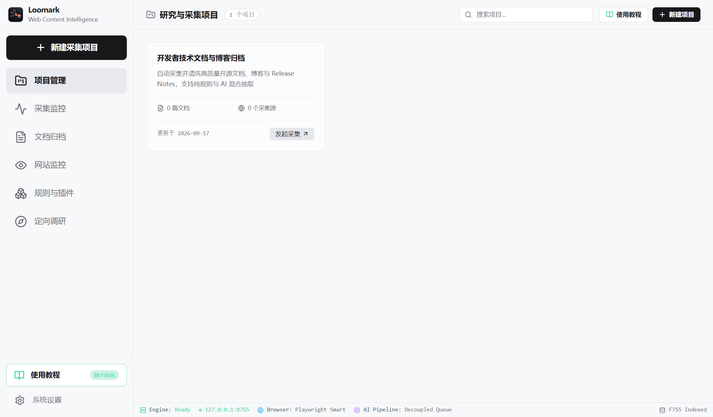
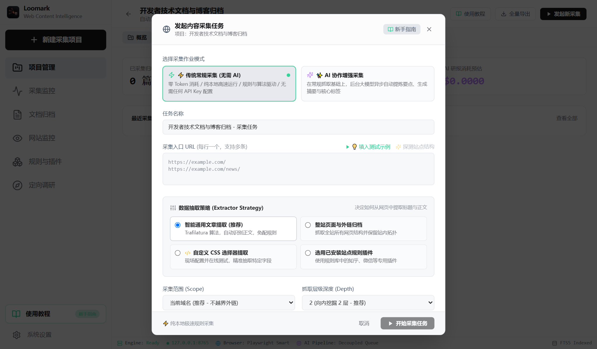
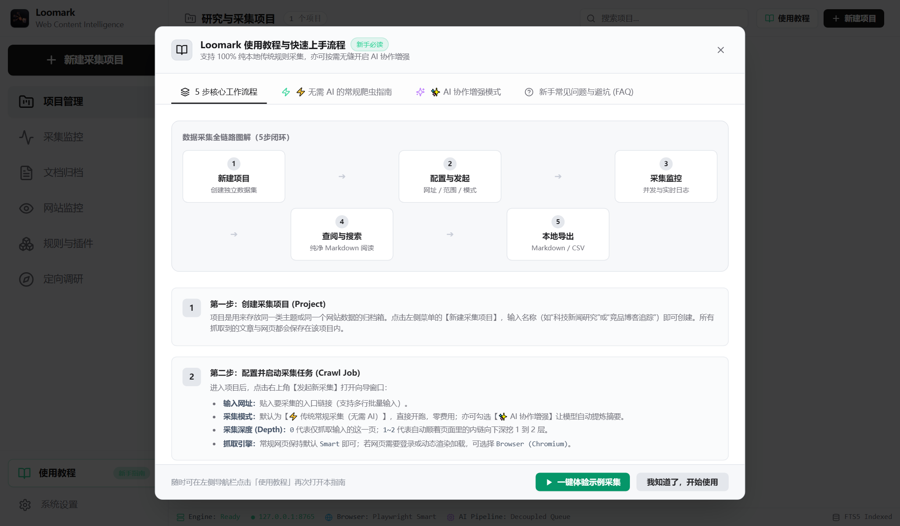
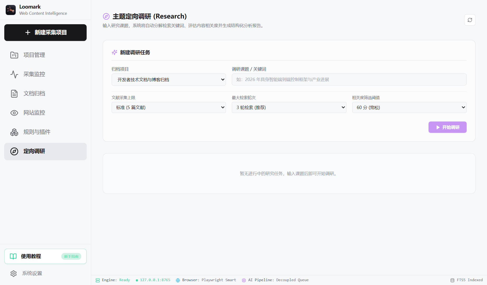

# Loomark

<p align="center">
  
</p>

<p align="center">
  <strong>面向个人研究、知识沉淀与网站监控的桌面级智能内容采集平台</strong>
</p>

<p align="center">
  <a href="https://github.com/rowanjove/Loomark/releases/latest"></a>
  
  
  
  
  
</p>

---

## 项目简介

**Loomark** 是一款面向独立开发者、技术研究员和内容创作者的桌面内容采集与归档工具。不同于传统的命令行爬虫脚本或重型云端 SaaS，Loomark 采用 **Tauri v2 + React 18 + Python FastAPI + SQLite** 的混合本地架构，兼顾轻量桌面客户端的交互体验与 Python 爬虫生态的灵活性。

所有抓取内容、网页快照和数据库均 **100% 存储于本地**，绝不上传私有数据。系统原生支持抗反爬嗅探、免规则正文提取、站内拓扑挖掘、增量内容监控，并可自选对接本地或云端大语言模型（Ollama / DeepSeek / OpenAI）实现自动摘要提炼与定向研究。

> **核心原则**：AI 是可选的生产力增强项，不是底层依赖。不配置任何 API Key，纯规则与算法采集同样具备全部核心能力。

---

## 界面预览

### 1. 项目管理工作台
直观管理多主题归档库，实时掌握各采集项目的数据规模与运行状态：


### 2. 多源采集任务向导
支持【纯本地极速规则采集】与【AI 协作增强采集】双模式，支持整站抓取、深度挖掘、动态渲染与特定插件抽取：


### 3. 全链路工作流指引
内置从项目新建、规则适配、并发调度到 Markdown/JSON 导出的完整新手实践指南：


### 4. 定向主题调研工作台
基于采集文档的全文检索与多轮检索聚合，自动生成多维度主题分析摘要：


---

## 核心特性

- **双引擎抗反爬抓取 (Hybrid Fetcher)**
  - **轻量高速通道**：基于 `curl_cffi`，内置最新 Chrome 浏览器 TLS 指纹与 JA3/HTTP2 伪装，兼顾高并发与隐蔽性。
  - **动态无头通道**：集成 Playwright 浏览器池，支持 JavaScript SPA 完整渲染，自动处理动态加载与 Cookie 状态保持。
- **免规则正文智能提取**
  - 集成 Trafilatura 与 Readability 算法，自动过滤导航栏、广告弹窗、页脚噪音，直接提取结构化 Markdown 与纯净正文。
  - 支持多源媒体与字幕下载（集成 `yt-dlp`），并支持通过本地/远程 Whisper ASR 引擎完成音视频转写。
- **站点级拓扑与队列调度 (URL Frontier)**
  - 智能 URL 规范化与布隆过滤去重，支持深度控制（Depth Limit）、同源域名限制与自适应请求速率限制（Rate Limiter）。
- **可扩展插件系统 (Adapter & Plugins)**
  - 声明式 JSON 规则配置，免写代码即可为特定网站（论坛、微信公众号、技术社区）定制字段级抽取逻辑。
- **本地归档与多格式导出**
  - 内置 SQLite 关系型存储与 FTS5 全文索引。
  - 支持将抓取文章一键导出为标准 Markdown 知识库、JSON 数据集或 CSV 清单。
- **站点增量监控 (Change Detection)**
  - 支持配置 Cron 周期轮询任务，结合内容 Diff 算法检测目标网页变动，精准记录历史版本差异。
- **可选的 AI 协作增强**
  - 异步解耦任务队列，后台静默生成文章摘要、核心关键词与情感倾向。
  - 兼容 OpenAI 标准 API（支持 DeepSeek、本地 Ollama、Qwen 等），成本可查可控。

---

## 技术架构

```text
┌──────────────────────────────────────────────────────────┐
│              Loomark 桌面客户端 (Tauri v2)               │
│  ┌────────────────────────────────────────────────────┐  │
│  │   前端界面 (React 18 + TypeScript + TailwindCSS)   │  │
│  └────────────────────────┬───────────────────────────┘  │
└───────────────────────────┼──────────────────────────────┘
                            │ REST / WebSocket (IPC/Localhost)
┌───────────────────────────▼──────────────────────────────┐
│             后端引擎 (Python 3.12 + FastAPI)              │
│  ┌───────────────────┐  ┌─────────────────────────────┐  │
│  │  调度与抓取引擎    │  │  正文与多媒体抽取器         │  │
│  │  - curl_cffi / h2 │  │  - Trafilatura / Readability│  │
│  │  - Playwright 池  │  │  - yt-dlp / Whisper ASR     │  │
│  └─────────┬─────────┘  └──────────────┬──────────────┘  │
│            │                           │                 │
│  ┌─────────▼─────────┐  ┌──────────────▼──────────────┐  │
│  │  SQLite 本地存储  │  │  AI 增强队列 (可选对接)     │  │
│  │  - FTS5 全文索引  │  │  - DeepSeek / Ollama / GPT  │  │
│  │  - 快照与版本记录 │  │  - 语义检索与分块提取        │  │
│  └───────────────────┘  └─────────────────────────────┘  │
└──────────────────────────────────────────────────────────┘
```

---

## 快速开始

### 运行环境准备

- **Node.js**: >= 18.0.0 (推荐安装 pnpm: `npm install -g pnpm`)
- **Python**: >= 3.10 (推荐 3.11 或 3.12)
- **Rust** (可选，仅用于编译 Tauri 桌面端安装包): 安装 `rustc` 与 `cargo`

### 1. 克隆代码仓库

```bash
git clone https://github.com/rowanjove/Loomark.git
cd Loomark
```

### 2. 初始化后端 Python 环境

```bash
# 创建并激活虚拟环境
python -m venv .venv

# Windows 激活
.venv\Scripts\activate

# 安装核心依赖
pip install -r engine/requirements.txt

# 安装 Playwright 浏览器内核 (用于动态页面抓取)
playwright install chromium
```

### 3. 初始化前端与桌面环境

```bash
# 安装前端依赖
pnpm install
```

### 4. 运行服务

**方式一：一键快速启动（推荐）**

直接双击运行根目录脚本：
```cmd
start_loomark.bat
```
脚本将自动拉起后端爬虫引擎服务（`127.0.0.1:8765`）并启动前端开发界面（`http://localhost:1420`）。

**方式二：手动分步启动**

终端 1（启动后端引擎）：
```bash
python run_loomark.py
```

终端 2（启动前端界面）：
```bash
pnpm dev
```

---

## 桌面端构建打包

通过 Tauri 将应用打包为轻量级 Windows 安装程序（`.msi` / `.exe`）：

```bash
pnpm tauri build
```

构建输出路径位于：`src-tauri/target/release/bundle/`。

---

## 插件编写示例

系统内置灵活的插件规范。在 `plugins/` 目录下添加自定义规则配置（`manifest.json`）：

```json
{
  "id": "my_tech_blog",
  "name": "技术博客适配器",
  "version": "1.0.0",
  "url_patterns": ["https://blog.example.com/posts/*"],
  "rules": {
    "title": {"selector": "h1.article-title", "type": "text"},
    "publish_time": {"selector": "time.post-date", "attr": "datetime"},
    "content": {"selector": "div.entry-content", "type": "markdown"},
    "tags": {"selector": "a.tag-link", "type": "list"}
  }
}
```

---

## 隐私安全与合规声明

1. **隐私安全**：Loomark 为纯本地软件，不集成任何第三方行为监控或分析打点。除用户自主配置的 AI 接口通信外，所有数据存储与请求均发生在本地环境。
2. **合规提示**：本项目开源用于个人学术研究、资料整理与知识沉淀。使用者应遵守目标网站的 `robots.txt` 协议与相关法律法规，请勿针对未授权目标进行高频过载抓取。

---

## 开源协议

本项目基于 [Apache-2.0 License](LICENSE) 开源发布。欢迎提交 Issue 与 Pull Request 共同改进！
